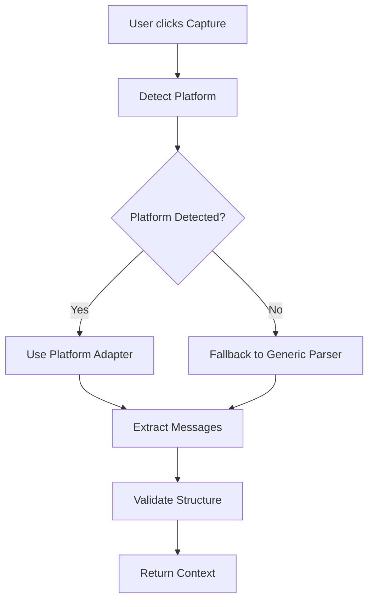

# DOM Parser Approaches Analysis for Context Bridge

## Executive Summary

This document analyzes different approaches for extracting conversation context from AI chat platform DOMs. The goal is to identify the most robust, maintainable, and performant solution.

---

## Current Implementation Analysis

### CSS Selector Approach (Current)
The current [`observer.js`](extension/src/content-scripts/core/observer.js:50) uses simple CSS selectors:

```javascript
messageSelector: '[data-message-author-role]',  // ChatGPT
messageSelector: '[data-test-render-count]',     // Claude
messageSelector: 'message-content',              // Gemini
```

**Issues with current approach:**
- Brittle - breaks when platforms update their UI
- No semantic understanding of message boundaries
- Fails with dynamic content loading
- No handling for nested structures

---

## Alternative DOM Parser Approaches

### 1. DOM Tree Traversal

```javascript
function extractMessagesViaDOMTraversal() {
    const messages = [];
    const walker = document.createTreeWalker(
        document.body,
        NodeFilter.SHOW_ELEMENT,
        {
            acceptNode: (node) => {
                // Identify message containers by semantic structure
                if (isMessageContainer(node)) {
                    return NodeFilter.FILTER_ACCEPT;
                }
                return NodeFilter.FILTER_SKIP;
            }
        }
    );

    let node;
    while (node = walker.nextNode()) {
        const message = parseMessageFromNode(node);
        if (message) messages.push(message);
    }

    return messages;
}

function isMessageContainer(node) {
    // Heuristics to identify message containers:
    // - Contains both user and assistant indicators
    // - Has consistent structure across siblings
    // - Contains text content
    // - Not inside interactive elements
    return node.querySelector('[data-message-author-role], [class*="message"]');
}
```

**Pros:**
- Robust against UI changes (follows structure, not classes)
- Can handle nested content
- Works with dynamic content

**Cons:**
- More complex code
- Slower performance
- Requires careful heuristics

---

### 2. Accessibility Tree API

```javascript
async function extractViaAccessibilityTree() {
    // Only available in Chromium-based browsers
    if (!window.getBuiltinTree) return null;

    const tree = await accessibilityTree();
    const messages = [];

    function traverse(node) {
        if (node.role === 'article' || node.role === 'group') {
            const message = parseAccessibilityNode(node);
            if (message) messages.push(message);
        }
        node.children?.forEach(traverse);
    }

    traverse(tree.root);
    return messages;
}
```

**Pros:**
- Most stable - follows semantic structure
- Independent of visual classes/IDs
- Works across platforms consistently

**Cons:**
- Limited browser support
- Performance overhead
- Not all information available

---

### 3. Visual/Position-Based Extraction

```javascript
function extractViaPosition() {
    const messages = [];
    const allElements = document.querySelectorAll('*');

    // Group elements by vertical position (same Y = same message)
    const positionGroups = groupByPosition(allElements);

    positionGroups.forEach(group => {
        const message = parsePositionGroup(group);
        if (message) messages.push(message);
    });

    return messages;
}

function groupByPosition(elements) {
    const groups = [];
    const threshold = 10; // pixels

    elements.forEach(el => {
        const rect = el.getBoundingClientRect();
        const y = Math.round(rect.top / threshold) * threshold;

        let group = groups.find(g => g.y === y);
        if (!group) {
            group = { y, elements: [] };
            groups.push(group);
        }
        group.elements.push(el);
    });

    return groups;
}
```

**Pros:**
- Platform-agnostic
- Works even with obfuscated classes
- Reliable message boundaries

**Cons:**
- Heavy DOM read operations
- Performance issues on large pages
- Fails with horizontal layouts

---

### 4. Shadow DOM Support (Essential for Modern Apps)

```javascript
function extractFromShadowDOM() {
    const messages = [];

    // Recursively traverse all shadow DOMs
    function traverseShadows(root) {
        // Find messages in this shadow root
        const shadowMessages = root.querySelectorAll('[data-message-author-role]');
        shadowMessages.forEach(msg => {
            const parsed = parseMessageElement(msg);
            if (parsed) messages.push(parsed);
        });

        // Find nested shadow hosts and traverse them
        const shadowHosts = root.querySelectorAll('*');
        shadowHosts.forEach(host => {
            if (host.shadowRoot) {
                traverseShadows(host.shadowRoot);
            }
        });
    }

    traverseShadows(document.body);
    return messages;
}
```

**Pros:**
- Essential for modern frameworks (React, Vue, Svelte)
- Access to encapsulated content
- Future-proof

**Cons:**
- Performance overhead
- Complex recursion
- Memory leaks if not handled properly

---

### 5. Platform-Specific Adapters (Recommended)

```javascript
// Platform adapter pattern
const PlatformParsers = {
    chatgpt: {
        version: '1.0',
        selectors: {
            container: '[data-testid^="conversation-turn-"]',
            message: '[data-message-author-role]',
            role: '[data-message-author-role]',
            content: '.markdown',
        },
        extract() {
            const turns = document.querySelectorAll(this.selectors.container);
            return Array.from(turns).map(turn => ({
                role: turn.querySelector(this.selectors.role)?.dataset.messageAuthorRole,
                content: turn.querySelector(this.selectors.content)?.textContent,
                timestamp: extractTimestamp(turn),
            }));
        },
        isAvailable() {
            return !!document.querySelector(this.selectors.container);
        }
    },
    claude: {
        version: '1.0',
        selectors: {
            container: '[data-testid="conversation-turn"]',
            message: '[data-test-render-count]',
            role: '[class*="role-"]',
            content: '[class*="content"]',
        },
        extract() {
            // Claude-specific extraction logic
        },
        isAvailable() {
            return !!document.querySelector(this.selectors.container);
        }
    }
};

class AdaptiveDOMParser {
    constructor() {
        this.platform = null;
        this.adapter = null;
    }

    detectPlatform() {
        for (const [name, parser] of Object.entries(PlatformParsers)) {
            if (parser.isAvailable()) {
                this.platform = name;
                this.adapter = parser;
                return { name, version: parser.version };
            }
        }
        return null;
    }

    extract() {
        if (!this.adapter) {
            throw new Error('No supported platform detected');
        }
        return this.adapter.extract();
    }
}
```

**Pros:**
- Maintainable - isolated platform code
- Testable - each adapter can be unit tested
- Extensible - easy to add new platforms
- Robust - fallback mechanisms

**Cons:**
- More initial development time
- Requires platform monitoring
- Version tracking needed

---

## Comparison Matrix

| Criteria | CSS Selectors | DOM Traversal | A11y Tree | Visual | Shadow DOM | Adapter Pattern |
|----------|---------------|---------------|-----------|--------|------------|-----------------|
| **Robustness** | Low | High | Very High | Medium | High | Very High |
| **Maintainability** | Low | Medium | Medium | Low | Medium | Very High |
| **Performance** | Very High | Medium | Low | Low | Medium | High |
| **Extensibility** | Low | Medium | Medium | Medium | Medium | Very High |
| **Shadow DOM** | No | No | Partial | No | Yes | Yes |
| **Testability** | Low | Medium | Low | Low | Medium | Very High |
| **Browser Support** | All | All | Chromium | All | All | All |

---

## Recommended Architecture

### Hybrid Approach: Adapter Pattern + Fallback



### Implementation Priority:

1. **Phase 1: Adapter Pattern Foundation**
   - Create platform adapter interface
   - Implement ChatGPT adapter
   - Add Claude adapter
   - Add Gemini adapter

2. **Phase 2: Robust Extraction**
   - Add Shadow DOM traversal
   - Implement message boundary detection
   - Add timestamp extraction

3. **Phase 3: Intelligence**
   - Detect conversation structure
   - Handle streaming content
   - Support for multi-modal content

---

## File Structure Recommendation

```
extension/src/content-scripts/
├── core/
│   ├── observer.js          # Main entry point
│   ├── parser.js            # AdaptiveDOMParser class
│   └── utils.js             # Shared utilities
├── platforms/
│   ├── base.js              # Base adapter class
│   ├── chatgpt.js           # ChatGPT-specific adapter
│   ├── claude.js            # Claude-specific adapter
│   └── gemini.js            # Gemini-specific adapter
└── processors/
    ├── text-processor.js    # Text extraction
    └── media-processor.js   # Image/chart extraction
```

---

## Next Steps

1. **Review and approve** the adapter pattern approach
2. **Prioritize platforms** to implement first
3. **Define adapter interface** contract
4. **Create implementation plan** with milestones

---

*Document Version: 1.0*
*Last Updated: 2026-01-29*
