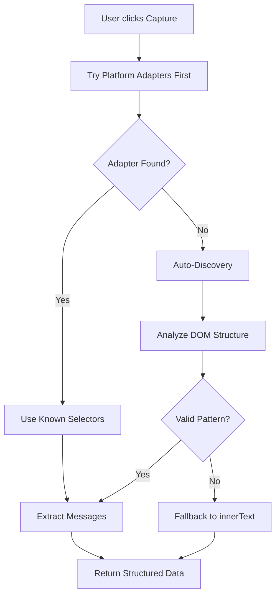

# DOM Parser Implementation Plan
## Hybrid Approach: Auto-Discovery + Platform Fallback

---

## Overview

This plan implements a hybrid DOM parser that:
1. **Auto-discovers** conversation structure on unknown platforms
2. **Uses platform-specific adapters** for known platforms (ChatGPT, Claude, Gemini)
3. **Falls back** to innerText extraction when all methods fail
4. **Supports Shadow DOM** for modern React/Vue applications

## Architecture



## File Structure

```
extension/src/content-scripts/
├── core/
│   ├── observer.js              # Main entry point (existing)
│   ├── parser.js                # NEW: Main parser orchestrator
│   ├── auto-discovery.js        # NEW: AutoDiscoveringParser class
│   └── utils.js                 # NEW: Shared utilities
├── platforms/
│   ├── base.js                  # NEW: PlatformAdapter base class
│   ├── chatgpt.js               # NEW: ChatGPT adapter
│   ├── claude.js                # NEW: Claude adapter
│   └── gemini.js                # NEW: Gemini adapter
└── processors/
    └── content-extractor.js     # NEW: Fallback extraction
```

## Implementation Steps

### Phase 1: Core Infrastructure

#### 1.1 Create PlatformAdapter Base Class

**File:** `extension/src/content-scripts/platforms/base.js`

```javascript
/**
 * Base class for platform-specific parsers
 */
class PlatformAdapter {
    constructor() {
        this.platformName = 'unknown';
        this.versions = {};
        this.selectorConfig = {};
    }
    
    /**
     * Detect if this adapter applies to current platform
     */
    detect() {
        throw new Error('detect() must be implemented');
    }
    
    /**
     * Get versioned selector configuration
     */
    getSelectors(version = 'latest') {
        return this.versions[version] || this.versions[Object.keys(this.versions)[0]];
    }
    
    /**
     * Parse conversation from current platform
     */
    parse() {
        throw new Error('parse() must be implemented');
    }
    
    /**
     * Get confidence score for this adapter (0-1)
     */
    getConfidence() {
        return 0;
    }
}
```

#### 1.2 Create Main Parser Orchestrator

**File:** `extension/src/content-scripts/core/parser.js`

```javascript
/**
 * Main DOM Parser Orchestrator
 * Coordinates between platform adapters and auto-discovery
 */
class DOMParser {
    constructor() {
        this.adapters = new Map();
        this.autoDiscoverer = new AutoDiscoveringParser();
        this.cache = new Map();
        this.fallbackExtractor = new FallbackContentExtractor();
    }
    
    /**
     * Register a platform adapter
     */
    registerAdapter(adapter) {
        this.adapters.set(adapter.platformName, adapter);
    }
    
    /**
     * Main parse entry point
     */
    async parse() {
        // Check cache first
        const cacheKey = this.getCacheKey();
        if (this.cache.has(cacheKey)) {
            const cached = this.cache.get(cacheKey);
            if (Date.now() - cached.timestamp < 60000) { // 1 minute cache
                return cached.data;
            }
        }
        
        // Try platform adapters first
        const adapter = this.findBestAdapter();
        let result;
        
        if (adapter) {
            result = this.parseWithAdapter(adapter);
        } else {
            // Fallback to auto-discovery
            result = await this.autoDiscoverer.discover();
            
            if (!result || result.confidence < 0.7) {
                // Final fallback
                result = this.fallbackExtractor.extract();
            }
        }
        
        // Cache the result
        this.cache.set(cacheKey, {
            data: result,
            timestamp: Date.now()
        });
        
        return result;
    }
    
    findBestAdapter() {
        let bestAdapter = null;
        let bestConfidence = 0;
        
        for (const adapter of this.adapters.values()) {
            if (adapter.detect()) {
                const confidence = adapter.getConfidence();
                if (confidence > bestConfidence) {
                    bestConfidence = confidence;
                    bestAdapter = adapter;
                }
            }
        }
        
        return bestAdapter;
    }
    
    parseWithAdapter(adapter) {
        const version = adapter.detectVersion();
        const selectors = adapter.getSelectors(version);
        
        return adapter.parse(selectors);
    }
    
    getCacheKey() {
        return `${window.location.hostname}-${window.location.pathname}`;
    }
}
```

### Phase 2: Auto-Discovery Parser

#### 2.1 Create AutoDiscoveringParser Class

**File:** `extension/src/content-scripts/core/auto-discovery.js`

```javascript
/**
 * Auto-discovers conversation structure without hard-coded selectors
 */
class AutoDiscoveringParser {
    constructor() {
        this.minMessageLength = 20;
        this.maxCandidates = 100;
        this.confidenceThreshold = 0.7;
    }
    
    /**
     * Main discovery entry point
     */
    async discover() {
        const candidates = await this.findTextCandidates();
        if (candidates.length < 2) {
            return { success: false, confidence: 0, reason: 'Not enough text candidates' };
        }
        
        const groups = this.groupByStructure(candidates);
        const pattern = this.identifyConversationPattern(groups);
        
        if (!pattern) {
            return { success: false, confidence: 0, reason: 'No conversation pattern found' };
        }
        
        const selectors = this.generateSelectors(pattern);
        const messages = this.extractMessages(pattern, selectors);
        
        return {
            success: true,
            confidence: this.calculateConfidence(messages, pattern),
            selectors,
            messages,
            timestamp: Date.now()
        };
    }
    
    async findTextCandidates() {
        // Use querySelectorAll with shadow DOM traversal
        const allElements = await this.querySelectorAllDeep('*');
        
        return allElements
            .filter(el => this.isMessageCandidate(el))
            .slice(0, this.maxCandidates);
    }
    
    async querySelectorAllDeep(selector, root = document.body) {
        const results = [];
        const stack = [root];
        
        while (stack.length && results.length < this.maxCandidates) {
            const node = stack.pop();
            
            if (node.matches && node.matches(selector)) {
                results.push(node);
            }
            
            // Traverse shadow DOM
            if (node.shadowRoot) {
                stack.push(node.shadowRoot);
            }
            
            // Traverse children
            const children = node.children || [];
            for (const child of Array.from(children)) {
                stack.push(child);
                if (child.shadowRoot) {
                    stack.push(child.shadowRoot);
                }
            }
        }
        
        return results;
    }
    
    isMessageCandidate(element) {
        // Skip interactive elements
        if (this.isInteractive(element)) return false;
        
        // Skip navigation/sidebar
        if (this.isNavigation(element)) return false;
        
        const text = element.textContent?.trim() || '';
        
        // Check minimum length
        if (text.length < this.minMessageLength) return false;
        
        // Skip if mostly code or special content
        const codeRatio = this.getCodeRatio(element);
        if (codeRatio > 0.5) return false;
        
        return true;
    }
    
    isInteractive(element) {
        const interactiveTags = ['BUTTON', 'INPUT', 'SELECT', 'TEXTAREA', 'A'];
        if (interactiveTags.includes(element.tagName)) return true;
        
        if (element.onclick || element.getAttribute('role') === 'button') return true;
        
        return false;
    }
    
    isNavigation(element) {
        const navRoles = ['navigation', 'banner', 'complementary'];
        if (navRoles.includes(element.getAttribute('role'))) return true;
        
        const navClasses = ['nav', 'sidebar', 'menu', 'header', 'footer'];
        if (navClasses.some(c => element.className?.toLowerCase().includes(c))) return true;
        
        return false;
    }
    
    getCodeRatio(element) {
        const codeElements = element.querySelectorAll('pre, code');
        const totalText = element.textContent?.length || 1;
        const codeText = Array.from(codeElements)
            .reduce((sum, el) => sum + (el.textContent?.length || 0), 0);
        return codeText / totalText;
    }
    
    groupByStructure(elements) {
        const groups = new Map();
        
        for (const el of elements) {
            const signature = this.getParentSignature(el);
            
            if (!groups.has(signature)) {
                groups.set(signature, []);
            }
            groups.get(signature).push(el);
        }
        
        // Sort by group size (largest first)
        return new Map([...groups.entries()].sort((a, b) => b[1].length - a[1].length));
    }
    
    getParentSignature(element) {
        const parent = element.parentElement;
        if (!parent) return 'root';
        
        const attrs = ['id', 'data-testid', 'data-test', 'role', 'aria-label'];
        const parts = [];
        
        for (const attr of attrs) {
            const value = parent.getAttribute(attr);
            if (value) {
                parts.push(`${attr}=${value}`);
            }
        }
        
        // Include class hash for non-specific elements
        if (parts.length === 0) {
            const classes = parent.className?.split(' ').slice(0, 3).join('.') || '';
            parts.push(`class=${classes}`);
        }
        
        return parts.join(';');
    }
    
    identifyConversationPattern(groups) {
        for (const [signature, elements] of groups) {
            if (elements.length < 2) continue;
            
            const texts = elements.map(el => ({
                element: el,
                text: el.textContent?.trim() || '',
                length: el.textContent?.trim()?.length || 0
            }));
            
            if (this.isConversationPattern(texts)) {
                return {
                    containerSignature: signature,
                    elements: texts,
                    messageCount: elements.length
                };
            }
        }
        
        return null;
    }
    
    isConversationPattern(texts) {
        if (texts.length < 2) return false;
        
        // Check for variance in message lengths
        const avgLength = texts.reduce((sum, t) => sum + t.length, 0) / texts.length;
        const variance = texts.reduce((sum, t) => sum + Math.pow(t.length - avgLength, 2), 0) / texts.length;
        
        // High variance = likely conversation (short user + long assistant)
        // Low variance = likely same-type content
        return variance > 1000 && texts.length >= 2;
    }
    
    generateSelectors(pattern) {
        const representative = pattern.elements[0].element;
        
        return {
            container: this.generateContainerSelector(representative),
            message: this.generateMessageSelector(representative),
            fallbackSelectors: this.generateFallbackSelectors(representative)
        };
    }
    
    generateContainerSelector(element) {
        const parent = element.parentElement;
        if (!parent) return null;
        
        // Try data attributes first
        for (const attr of ['data-testid', 'data-test', 'data-id']) {
            if (parent.hasAttribute(attr)) {
                return `[${attr}="${parent.getAttribute(attr)}"]`;
            }
        }
        
        // Try class-based selector
        const classes = parent.className?.split(' ').filter(c => c.length > 2);
        if (classes?.length) {
            return `.${classes.slice(0, 3).join('.')}`;
        }
        
        return null;
    }
    
    generateMessageSelector(element) {
        // Try to find a unique attribute on the element itself
        for (const attr of ['data-message-author-role', 'data-testid', 'data-role']) {
            if (element.hasAttribute(attr)) {
                return `[${attr}]`;
            }
        }
        
        return null;
    }
    
    generateFallbackSelectors(element) {
        const fallbacks = [];
        
        // By class patterns
        const classPatterns = [
            '[class*="message"]',
            '[class*="turn"]',
            '[class*="conversation"]',
            '[class*="chat"]'
        ];
        
        // By tag patterns
        const tagPatterns = [
            'article',
            '[role="article"]',
            '[role="log"]'
        ];
        
        return [...classPatterns, ...tagPatterns];
    }
    
    extractMessages(pattern, selectors) {
        if (!selectors.container) {
            return pattern.elements.map(e => ({
                role: this.detectRole(e.element),
                content: e.text,
                timestamp: this.extractTimestamp(e.element)
            }));
        }
        
        const containers = document.querySelectorAll(selectors.container);
        return Array.from(containers).map(container => ({
            role: this.detectRole(container),
            content: container.textContent?.trim() || '',
            timestamp: this.extractTimestamp(container)
        }));
    }
    
    detectRole(element) {
        // Check data attributes
        const roleAttr = element.getAttribute('data-message-author-role');
        if (roleAttr) return roleAttr;
        
        // Check class patterns
        const className = element.className?.toLowerCase() || '';
        if (className.includes('user') || className.includes('human')) return 'user';
        if (className.includes('assistant') || className.includes('bot') || className.includes('ai')) return 'assistant';
        
        // Check parent for role
        const parent = element.closest('[data-message-author-role]');
        if (parent) return parent.getAttribute('data-message-author-role');
        
        return 'unknown';
    }
    
    extractTimestamp(element) {
        // Look for timestamp attributes or elements
        const timeElement = element.querySelector('time');
        if (timeElement) {
            return timeElement.getAttribute('datetime') || timeElement.textContent;
        }
        
        // Check for data attributes
        const timestamp = element.getAttribute('data-timestamp');
        if (timestamp) return timestamp;
        
        return null;
    }
    
    calculateConfidence(messages, pattern) {
        let score = 0;
        
        // Has minimum messages
        if (messages.length >= 2) score += 0.2;
        if (messages.length >= 5) score += 0.1;
        
        // Role detection accuracy
        const knownRoles = messages.filter(m => m.role !== 'unknown').length;
        if (knownRoles / messages.length > 0.8) score += 0.3;
        
        // Content quality
        const avgLength = messages.reduce((sum, m) => sum + m.content.length, 0) / messages.length;
        if (avgLength > 50) score += 0.2;
        if (avgLength > 200) score += 0.1;
        
        // Pattern consistency
        if (pattern.messageCount === messages.length) score += 0.1;
        
        return Math.min(score, 1);
    }
}
```

### Phase 3: Platform Adapters

#### 3.1 ChatGPT Adapter

**File:** `extension/src/content-scripts/platforms/chatgpt.js`

```javascript
/**
 * ChatGPT-specific parser adapter
 */
class ChatGPTAdapter extends PlatformAdapter {
    constructor() {
        super();
        this.platformName = 'chatgpt';
        this.urlPattern = /chat\.openai\.com/;
        
        this.versions = {
            'latest': {
                selectors: {
                    container: '[data-testid="conversation-turn"]',
                    message: '[data-message-author-role]',
                    role: 'data-message-author-role',
                    content: '.markdown'
                }
            },
            '2024-01': {
                selectors: {
                    container: '[data-message-author-role]',
                    message: '[data-message-author-role]',
                    role: 'data-message-author-role',
                    content: '.markdown'
                }
            }
        };
    }
    
    detect() {
        return this.urlPattern.test(window.location.href);
    }
    
    detectVersion() {
        const container = document.querySelector('[data-testid="conversation-turn"]');
        return container ? 'latest' : '2024-01';
    }
    
    getConfidence() {
        // High confidence when URL matches and selectors found
        const container = document.querySelector('[data-testid="conversation-turn"]');
        return container ? 0.95 : 0.8;
    }
    
    parse(selectors = null) {
        const config = selectors || this.getSelectors();
        const containers = document.querySelectorAll(config.selectors.container);
        
        if (!containers.length) {
            return null;
        }
        
        return Array.from(containers).map(container => {
            const role = container.querySelector(`[${config.selectors.role}]`)?.dataset.messageAuthorRole;
            const contentEl = container.querySelector(config.selectors.content);
            
            return {
                role: role || 'unknown',
                content: contentEl?.textContent?.trim() || container.textContent?.trim() || '',
                platform: 'chatgpt',
                timestamp: this.extractTimestamp(container)
            };
        });
    }
    
    extractTimestamp(element) {
        const timeEl = element.querySelector('time');
        return timeEl?.getAttribute('datetime') || null;
    }
}
```

#### 3.2 Claude Adapter

**File:** `extension/src/content-scripts/platforms/claude.js`

```javascript
/**
 * Claude-specific parser adapter
 */
class ClaudeAdapter extends PlatformAdapter {
    constructor() {
        super();
        this.platformName = 'claude';
        this.urlPattern = /claude\.ai/;
        
        this.versions = {
            'latest': {
                selectors: {
                    container: '[data-testid="conversation-turn"]',
                    message: '[data-test-render-count]',
                    role: '[class*="role-"]',
                    content: '[class*="content"]'
                }
            }
        };
    }
    
    detect() {
        return this.urlPattern.test(window.location.href);
    }
    
    getConfidence() {
        const turn = document.querySelector('[data-testid="conversation-turn"]');
        return turn ? 0.95 : 0.8;
    }
    
    parse(selectors = null) {
        const config = selectors || this.getSelectors();
        const turns = document.querySelectorAll('[data-testid="conversation-turn"]');
        
        if (!turns.length) {
            return this.legacyParse();
        }
        
        return Array.from(turns).map(turn => ({
            role: this.detectRole(turn),
            content: turn.textContent?.trim() || '',
            platform: 'claude',
            timestamp: null
        }));
    }
    
    detectRole(element) {
        // Check class for role
        const className = element.className || '';
        if (className.includes('human') || className.includes('user')) return 'user';
        if (className.includes('assistant') || className.includes('claude')) return 'assistant';
        
        // Check position (odd = user, even = assistant typically)
        return null; // Will use position-based detection
    }
    
    legacyParse() {
        // Fallback for older Claude versions
        const messages = document.querySelectorAll('[data-test-render-count]');
        return Array.from(messages).map((msg, index) => ({
            role: index % 2 === 0 ? 'user' : 'assistant',
            content: msg.textContent?.trim() || '',
            platform: 'claude'
        }));
    }
}
```

#### 3.3 Gemini Adapter

**File:** `extension/src/content-scripts/platforms/gemini.js`

```javascript
/**
 * Gemini-specific parser adapter
 */
class GeminiAdapter extends PlatformAdapter {
    constructor() {
        super();
        this.platformName = 'gemini';
        this.urlPattern = /gemini\.google\.com/;
        
        this.versions = {
            'latest': {
                selectors: {
                    container: 'message-content',
                    message: 'message-content',
                    role: null, // Determined by position
                    content: null
                }
            }
        };
    }
    
    detect() {
        return this.urlPattern.test(window.location.href);
    }
    
    getConfidence() {
        const msg = document.querySelector('message-content');
        return msg ? 0.9 : 0.7;
    }
    
    parse(selectors = null) {
        const messages = document.querySelectorAll('message-content');
        
        return Array.from(messages).map((msg, index) => ({
            role: index % 2 === 0 ? 'user' : 'assistant',
            content: msg.textContent?.trim() || '',
            platform: 'gemini',
            timestamp: null
        }));
    }
}
```

### Phase 4: Fallback Extractor

#### 4.1 FallbackContentExtractor

**File:** `extension/src/content-scripts/processors/content-extractor.js`

```javascript
/**
 * Fallback extractor when all other methods fail
 */
class FallbackContentExtractor {
    extract() {
        return {
            raw: this.extractMainContent(),
            platform: 'unknown',
            warning: 'Used fallback extraction - structure may not be optimal',
            timestamp: Date.now()
        };
    }
    
    extractMainContent() {
        // Try to find main content area
        const mainContent = document.querySelector('main') ||
                           document.querySelector('[role="main"]') ||
                           document.body;
        
        // Remove unwanted elements
        const clone = mainContent.cloneNode(true);
        this.removeUnwantedElements(clone);
        
        return clone.innerText || clone.textContent;
    }
    
    removeUnwantedElements(container) {
        const unwantedSelectors = [
            'nav', 'header', 'footer', 'aside',
            '.nav', '.sidebar', '.menu',
            '[role="navigation"]', '[role="banner"]',
            'script', 'style', 'noscript',
            '.ad', '.advertisement', '[class*="ad-"]',
            '.cookie', '.popup', '.modal'
        ];
        
        for (const selector of unwantedSelectors) {
            const elements = container.querySelectorAll(selector);
            elements.forEach(el => el.remove());
        }
    }
}
```

### Phase 5: Integration with Existing Code

#### 5.1 Update observer.js

```javascript
// Replace the existing captureContext function with:
async function captureContext() {
    const parser = new DOMParser();
    
    // Register platform adapters
    parser.registerAdapter(new ChatGPTAdapter());
    parser.registerAdapter(new ClaudeAdapter());
    parser.registerAdapter(new GeminiAdapter());
    
    // Parse conversation
    const result = await parser.parse();
    
    if (result.success) {
        return {
            platform: 'auto-detected',
            messages: result.messages,
            confidence: result.confidence
        };
    }
    
    // Return fallback result
    return {
        platform: 'unknown',
        raw: result.raw,
        warning: result.warning
    };
}
```

## Testing Plan

### Unit Tests

1. **PlatformAdapter base class**
   - Detect method
   - Version selection
   - Confidence calculation

2. **AutoDiscoveringParser**
   - Text candidate filtering
   - Structure grouping
   - Pattern identification
   - Selector generation

3. **Platform adapters**
   - URL matching
   - Selector validation
   - Message extraction

### Integration Tests

1. Test on ChatGPT (with multiple conversation states)
2. Test on Claude
3. Test on Gemini
4. Test on unknown platform (auto-discovery)
5. Test with Shadow DOM content

## Success Criteria

- [ ] Parse messages from ChatGPT, Claude, Gemini
- [ ] Auto-discovery works on at least one unknown platform
- [ ] Shadow DOM content is properly extracted
- [ ] Fallback to innerText works when selectors fail
- [ ] Parser cache reduces repeated DOM queries
- [ ] Confidence scoring helps identify reliable extractions

## Estimated Complexity

| Component | Complexity |
|-----------|------------|
| PlatformAdapter Base | Low |
| DOMParser Orchestrator | Medium |
| AutoDiscoveringParser | High |
| Platform Adapters (x3) | Low |
| Fallback Extractor | Low |
| Integration | Medium |

---

*Document Version: 1.0*
*Last Updated: 2026-01-29*
