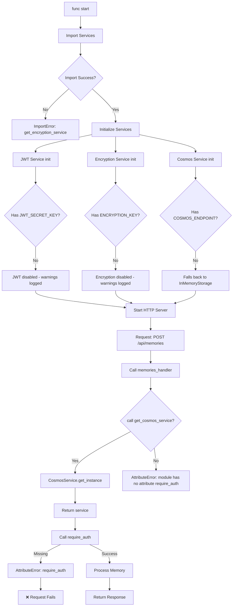

# Context Bridge - Workflow Analysis & Error Report

**Date:** 2026-01-28  
**Status:** Implementation In Progress  
**Phase:** Post-Phase 0 Investigation Complete

---

## Executive Summary

The implementation has made significant progress following the Opus prompt. Key infrastructure services (Encryption, JWT, Cosmos DB) are implemented. However, **several critical errors and missing components will prevent the application from running**.

### Critical Issues Found

| Severity | Count | Status |
|----------|-------|--------|
| 🔴 Critical | 3 | Missing functions, incomplete imports |
| 🟠 High | 4 | Configuration errors, missing endpoints |
| 🟡 Medium | 3 | Cleanup needed |

---

## Implementation Status Overview

### ✅ Completed Items

| Component | File | Status |
|-----------|------|--------|
| ADK Investigation | `plans/ADK_INVESTIGATION.md` | ✅ Complete |
| Requirements | `backend/requirements.txt` | ✅ Updated |
| Agent Module | `backend/agents/agent.py` | ✅ ADK imports correct |
| Encryption Service | `backend/services/encryption.py` | ✅ Implemented |
| JWT Service | `backend/services/jwt_service.py` | ✅ Implemented |
| Cosmos Service | `backend/services/cosmos.py` | ✅ Implemented |
| Error Middleware | `backend/middleware/errors.py` | ✅ Implemented |
| Auth Middleware | `backend/middleware/auth.py` | ⚠️ Incomplete |
| Service Exports | `backend/services/__init__.py` | ⚠️ Missing function |
| Middleware Exports | `backend/middleware/__init__.py` | ✅ Complete |
| Function Routes | `backend/function_app.py` | ✅ Defined |
| Memories Handler | `backend/functions/memories.py` | ⚠️ Uses non-existent functions |
| Config Template | `backend/local.settings.example.json` | ⚠️ Has errors |

---

## 🔴 Critical Errors

### 1. Missing `get_encryption_service()` Function

**File:** `backend/services/__init__.py:10`

**Problem:**
```python
from .encryption import EncryptionService, EncryptionError, get_encryption_service
```

The import references `get_encryption_service` but this function **does not exist** in `encryption.py`.

**Error:**
```
ImportError: cannot import name 'get_encryption_service' from 'services.encryption'
```

**Fix Required:**
Add singleton pattern to `encryption.py`:
```python
_encryption_service: Optional[EncryptionService] = None

def get_encryption_service() -> EncryptionService:
    """Get the singleton encryption service instance."""
    global _encryption_service
    if _encryption_service is None:
        _encryption_service = EncryptionService()
    return _encryption_service
```

---

### 2. Missing Auth Middleware Helper Functions

**File:** `backend/middleware/auth.py`

**Problem:** The `middleware/__init__.py` exports `require_auth`, `require_json_body`, `require_fields` but these functions **do not exist** in `auth.py`.

**Current `auth.py` exports:**
- `extract_token` ✅
- `get_user_from_token` ✅
- `authenticate_request` ✅
- `require_auth` ❌ MISSING
- `require_json_body` ❌ MISSING
- `require_fields` ❌ MISSING

**Error:**
```
AttributeError: module 'middleware' has no attribute 'require_auth'
```

**Fix Required:**
Add to `backend/middleware/auth.py`:

```python
def require_auth(req: func.HttpRequest) -> Dict[str, Any]:
    """
    Require authentication for request.
    
    Returns user dict if authenticated, raises error otherwise.
    """
    user = authenticate_request(req)
    if not user:
        raise AuthenticationError("Authentication required")
    return user
```

And add utility functions (or move to separate utils module):

```python
def require_json_body(req: func.HttpRequest) -> Dict[str, Any]:
    """Require JSON body in request."""
    try:
        body = req.get_json()
        if body is None:
            raise ValidationError("Request body must be JSON")
        return body
    except ValueError:
        raise ValidationError("Invalid JSON in request body")

def require_fields(body: Dict, fields: List[str]) -> None:
    """Require specific fields in request body."""
    missing = [f for f in fields if f not in body]
    if missing:
        raise ValidationError(f"Missing required fields: {', '.join(missing)}")
```

---

### 3. API Key Configuration Mismatch

**File:** `backend/local.settings.example.json:6-7`

**Problem:**
```json
"GOOGLE_API_KEY": "your-gemini-api-key-here",
"GEMINI_API_KEY": "your-gemini-api-key-here",
```

**Issues:**
1. Duplicate keys with same value
2. Comment says `GEMINI_API_KEY` but ADK uses `GOOGLE_API_KEY`
3. Should be a single, clear configuration

**Fix Required:**
Remove `GEMINI_API_KEY` or use only one consistently:

```json
"GOOGLE_API_KEY": "your-gemini-api-key-here",
```

---

## 🟠 High Priority Issues

### 4. Missing Auth Handler Function

**File:** `backend/function_app.py:73-81`

**Problem:** Route defined for `/api/auth/google` and `/api/auth/user` but `auth_handler` function is referenced but may not exist or may not handle all auth routes.

**Current Routes:**
```python
@app.route(route="auth/google", methods=["POST"])
def auth_google(req: func.HttpRequest) -> func.HttpResponse:
    return auth_handler(req)

@app.route(route="auth/user", methods=["GET"])
def auth_user(req: func.HttpRequest) -> func.HttpResponse:
    return auth_handler(req)
```

**Check Required:**
Verify `backend/functions/auth.py` exists and has `auth_handler(req)` that:
- Handles POST `/auth/google` for Google ID token verification
- Handles GET `/auth/user` for getting current user info

---

### 5. Missing Token Refresh Endpoint

**Current Routes:**
- `POST /api/auth/google` - Verify Google ID token
- `GET /api/auth/user` - Get current user

**Missing:**
- `POST /api/auth/refresh` - Refresh access token using refresh token

**Impact:** JWT access tokens expire in 15 minutes with no way to refresh.

**Fix Required:**
Add to `backend/function_app.py`:
```python
@app.route(route="auth/refresh", methods=["POST"])
def auth_refresh(req: func.HttpRequest) -> func.HttpResponse:
    """POST /api/auth/refresh - Refresh access token"""
    return auth_handler(req)
```

---

### 6. Missing Share Handler Functions

**File:** `backend/functions/share.py`

**Current Routes in `function_app.py`:**
```python
@app.route(route="share", methods=["POST"])
def share(req: func.HttpRequest) -> func.HttpResponse:
    return share_handler(req)

@app.route(route="shared/{share_code}", methods=["GET"])
def shared(req: func.HttpRequest) -> func.HttpResponse:
    return share_handler(req)
```

**Check Required:**
Verify `backend/functions/share.py` has:
- `share_handler(req)` for POST `/share`
- Logic to handle share code lookup for GET `/shared/{share_code}`

---

### 7. Missing Sanitize & Curate Handlers

**File:** `backend/function_app.py:34-42`

**Routes:**
```python
@app.route(route="sanitize", methods=["POST"])
def sanitize(req: func.HttpRequest) -> func.HttpResponse:
    return sanitize_handler(req)

@app.route(route="curate", methods=["POST"])
def curate(req: func.HttpRequest) -> func.HttpResponse:
    return curate_handler(req)
```

**Check Required:**
Verify these files exist:
- `backend/functions/sanitize.py` - has `sanitize_handler(req)`
- `backend/functions/curate.py` - has `curate_handler(req)`

---

## 🟡 Medium Priority Issues

### 8. Environment Variables Not Loaded

**Problem:** Azure Functions loads `local.settings.json` automatically, but running locally with `func start` may not load all values into environment.

**Impact:** `os.environ.get()` may return `None` even when values exist in `local.settings.json`.

**Fix:**
```python
# Add at top of files that need config
from dotenv import load_dotenv
load_dotenv()  # Load .env file
```

Add to `backend/requirements.txt`:
```
python-dotenv==1.0.0  # Already there ✅
```

Ensure `load_dotenv()` is called in service initialization.

---

### 9. No Request Correlation ID

**Problem:** Logs don't have correlation IDs for request tracing.

**Impact:** Difficult to trace logs across multiple function calls.

**Fix:**
Add correlation ID middleware to `backend/function_app.py`:
```python
@app.function_name(name="ContextBridge")
@app.route(route="{*path}", methods=["GET", "POST"])
def main(req: func.HttpRequest) -> func.HttpResponse:
    # Generate or extract correlation ID
    correlation_id = req.headers.get('X-Correlation-ID', str(uuid.uuid4()))
    
    # Add to context
    logging.getLogger().info(f"Request started: {correlation_id}")
    
    # Process request...
```

---

### 10. Missing .env File Template

**Problem:** No `.env.example` file for local development.

**Impact:** Developers don't know what environment variables to set.

**Fix Required:**
Create `backend/.env.example`:
```
GOOGLE_API_KEY=your-gemini-api-key-here
COSMOS_ENDPOINT=https://your-account.documents.azure.com:443/
COSMOS_KEY=your-cosmos-master-key-here
COSMOS_DATABASE=contextbridge
ENCRYPTION_KEY=your-64-character-hex-key-here
JWT_SECRET_KEY=your-jwt-secret-key-min-32-characters
```

---

## Workflow Diagram (Current State)



---

## Recommended Fix Order

### Phase 1: Critical Fixes (Must Fix First)

1. **Fix Missing Functions**
   - Add `get_encryption_service()` to `encryption.py`
   - Add `require_auth()`, `require_json_body()`, `require_fields()` to `auth.py`

2. **Fix Configuration**
   - Remove duplicate `GEMINI_API_KEY` from `local.settings.example.json`

### Phase 2: Verification

3. **Verify Handlers Exist**
   - Check `backend/functions/auth.py` has `auth_handler(req)`
   - Check `backend/functions/sanitize.py` has `sanitize_handler(req)`
   - Check `backend/functions/curate.py` has `curate_handler(req)`
   - Check `backend/functions/share.py` has `share_handler(req)`

4. **Add Missing Endpoints**
   - Add `POST /api/auth/refresh` endpoint

### Phase 3: Polish

5. **Add Request Correlation ID**
6. **Create .env.example**
7. **Add dotenv loading**

---

## Testing Checklist

Run these commands after fixes:

```bash
# 1. Verify ADK imports
python -c "from google.adk.agents import LlmAgent, SequentialAgent; print('✓ ADK imports work')"

# 2. Verify services import
python -c "
from services import get_cosmos_service, get_encryption_service, get_jwt_service
print('✓ Services import work')
"

# 3. Verify middleware import
python -c "
from middleware import require_auth, require_json_body, require_fields
print('✓ Middleware imports work')
"

# 4. Start functions
func start --python &
sleep 5

# 5. Test health endpoint
curl http://localhost:7071/api/health
```

---

## Next Steps

1. **Immediate:** Fix the 3 critical errors (missing functions)
2. **Verify:** Check all handler files exist
3. **Test:** Run application and test endpoints
4. **Document:** Update README with setup instructions

---

*Generated by Senior Architect - Workflow Analysis*
*Date: 2026-01-28*
